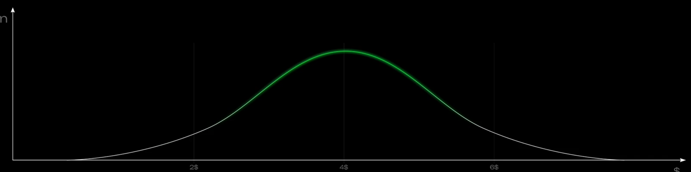

# Trading Notes

[Price Actions ](./price-actions/README.md)  
[Точки входа ](./entry_points/README.md)

## Что такое рынок?

Рынок это система экономических отношений, которая складывается между покупателями и продавцами по поводу обмена товарами, услугами и ресурсами.

### Основные функции рынка.

**Ценообразование** - определяется на основе взаимодейсвия спроса и предложения, формируя справедливую цену актива.  
**Стимулирование** - рынок побуждает участников к совершению сделок за счёт аукционного процесса.

Функции рынка заключаются в обеспечении эффективного распределения ресурсов.  
Рынок объединяет продавцов и покупателей, чтобы обмениваться товарами, услугами и ресурсами по определённой цене. Это позволяет поределить стоимость товаров и услуг, стимулирует конкуренцию, способствует инновациям и удовлетворяет потебности общества.

### Ценообразование:

**Эффективное ценообразование**.

- когда цена находится в области справедливой стоимости (**Fair Value**), и покупатель с продавцом соглашаюстя с текущей ценой.

**Неэффективное ценообразование**.

- возникает из-за сильного дисбаланса, когда спрос или предложение занчительно доминируют и цена выходит за пределы справедливой стоимости

**AMT (Auction Market Theory)** утверждает, что цена движется вверх и вниз в зависимости от баланса спроса и предложения.

**Fair Value (Справедливая стоимость)**

- ценовой диапазон, где силы продавцов и покупателей сбалансированы и совершается наибольшее количество сделок.

Обычно около 70% торгов присходит в рамках этой зоны.  
Когда дисбаланс превышает допустимые границы, цена выходит из зоны баланса и формирует неэффективные участки, которые со временем стремиться заполнить

