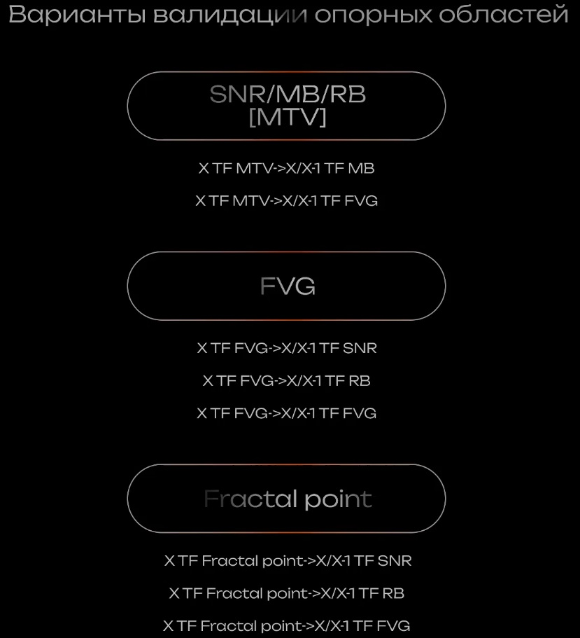

# Работа с POI

**POI** - (Point of Interest) точки интереса.

- [SNR](./docs/SNR.pdf)
- [MB](./docs/MB.pdf)
- [FVG](./docs/FVG.pdf)
- [RB](./docs/RB.pdf)
- [Fractal Point](./docs/Fractal.pdf)

**POI (Point Of Interest)** - зоны интереса, ценовая область на графике, где ожидается возможная реакция рынка (разворот, откат, продолжение движения).  
К POI относятся следующие элементы:

- SNR (Support And Resistance)
- MB (Mitigation Block)
- FVG (Fair Value Gap)
- RB (Rejection Block)
- Fractal Point
  
